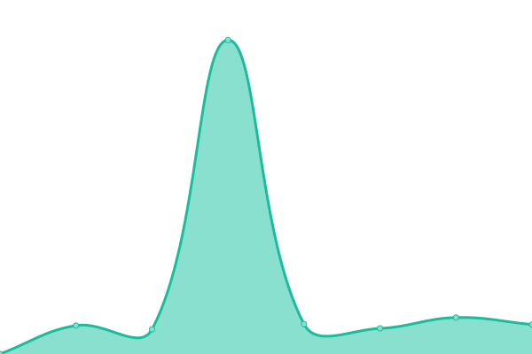

# [📈 Live Status](https://upptime.github.io/upptime): <!--live status--> **🟧 Partial outage**

This repository contains the open-source uptime monitor and status page for [Upptime](https://upptime.js.org), powered by [Upptime](https://github.com/upptime/upptime).

With [Upptime](https://upptime.js.org), you can get your own unlimited and free uptime monitor and status page, powered entirely by a GitHub repository. We use [Issues](https://github.com/upptime/upptime/issues) as incident reports, [Actions](https://github.com/upptime/upptime/actions) as uptime monitors, and [Pages](https://upptime.github.io/upptime) for the status page.

<!--start: status pages-->
<!-- This summary is generated by Upptime (https://github.com/upptime/upptime) -->
<!-- Do not edit this manually, your changes will be overwritten -->
<!-- prettier-ignore -->
| URL | Status | History | Response Time | Uptime |
| --- | ------ | ------- | ------------- | ------ |
|  [SendIT](https://sendit.dannluciano.com.br) | 🟥 Down | [send-it.yml](https://github.com/dannluciano/upptime/commits/HEAD/history/send-it.yml) | 

 844ms
     
 | 

<a href="https://dannluciano.github.io/upptime/history/send-it">99.19%</a>
    

|  [Orgânicos Zabelê](https://www.organicosrn.eco.br) | 🟩 Up | [organicos-zabele.yml](https://github.com/dannluciano/upptime/commits/HEAD/history/organicos-zabele.yml) | 

 537ms
     
 | 

<a href="https://dannluciano.github.io/upptime/history/organicos-zabele">100.00%</a>
    

|  [NextCloud](https://cloud.dannluciano.com.br) | 🟩 Up | [next-cloud.yml](https://github.com/dannluciano/upptime/commits/HEAD/history/next-cloud.yml) | 

 594ms
     
 | 

<a href="https://dannluciano.github.io/upptime/history/next-cloud">100.00%</a>
    

|  [IFPI](https://www.ifpi.edu.br/) | 🟩 Up | [ifpi.yml](https://github.com/dannluciano/upptime/commits/HEAD/history/ifpi.yml) | 

 2801ms
     
 | 

<a href="https://dannluciano.github.io/upptime/history/ifpi">100.00%</a>
    

|  [LiveBoards](https://liveboards.herokuapp.com/) | 🟩 Up | [live-boards.yml](https://github.com/dannluciano/upptime/commits/HEAD/history/live-boards.yml) | 

 216ms
     
 | 

<a href="https://dannluciano.github.io/upptime/history/live-boards">100.00%</a>
    

<!--end: status pages-->

[**Visit our status website →**](https://upptime.github.io/upptime)

## 📄 License

- Powered by: [Upptime](https://github.com/upptime/upptime)
- Code: [MIT](./LICENSE) © [Upptime](https://upptime.js.org)
- Data in the `./history` directory: [Open Database License](https://opendatacommons.org/licenses/odbl/1-0/)
